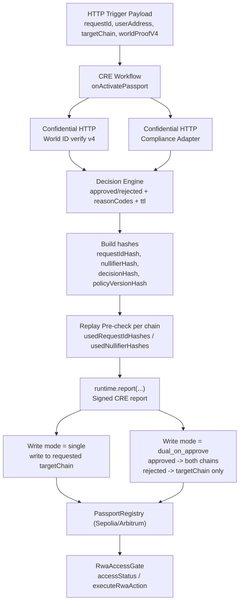

# Passentra - Judge Pack

## 1) What CRE Uniquely Enables

- **Confidential HTTP inside workflow execution**: World ID verification and compliance evaluation are performed through CRE Confidential HTTP with secrets fetched at runtime.
- **Consensus-verified execution outputs**: External capability calls resolve through `.result()`, so the workflow branches on DON-agreed results.
- **Signed report -> onchain write pipeline**: `runtime.report(...)` creates a cryptographically signed report that is written onchain via `EVMClient.writeReport(...)`.
- **One workflow, many chains**: The same execution can write to one or multiple EVM chains using chain selectors (`single` vs `dual_on_approve`).
- **Replay resistance across runs**: The workflow pre-checks replay state and the registry enforces replay protection onchain.

## 2) Architecture Diagram

Diagram source: `docs/architecture.mmd`

Partner integration guide: [`INTEGRATION.md`](INTEGRATION.md)



## 3) Confidential HTTP Path

1. HTTP trigger payload arrives in workflow callback.
2. Workflow calls World ID verify endpoint through Confidential HTTP (`world-id.ts`).
3. Workflow calls compliance adapter through Confidential HTTP (`compliance.ts`).
4. Secrets are read with `runtime.getSecret(...)` and never hardcoded in payloads.
5. Final decision is produced from World ID + compliance outputs.

## 4) Multi-Chain Write Mode

- Config key: `writeMode` in `workflow/config.staging.write.json` or `workflow/config.staging.write.dual.json`.

| Mode | Approved | Rejected |
|---|---|---|
| `single` | write only to `targetChain` | write only to `targetChain` |
| `dual_on_approve` | write to all configured chains | write only to `targetChain` |

## 5) Replay Guarantees

- **Workflow layer** (`workflow/src/onchain.ts`): reads `usedRequestIdHashes` and `usedNullifierHashes` before write.
- **Contract layer** (`../Passentra-contracts/src/PassportRegistry.sol`): reverts if request hash or nullifier hash was already consumed.
- **Net effect**: a replayed payload cannot create a second valid stamp.

## 6) Terminal Demo (Judge Path)

From `Passentra-CRE/`:

```bash
WORLD_ID_VERIFIER_API_KEY_ALL=... \
COMPLIANCE_ADAPTER_API_KEY_ALL=... \
TARGET=staging-write-dual-settings \
BROADCAST=1 \
CHECK_GATE=1 \
./scripts/run-demo.sh
```

Expected scenario outcomes:

- `approved`: `decision=approved`, onchain write succeeds.
- `rejected`: `decision=rejected`, gate check remains denied.
- `replay`: write reverts with `REPLAY_DETECTED`.
